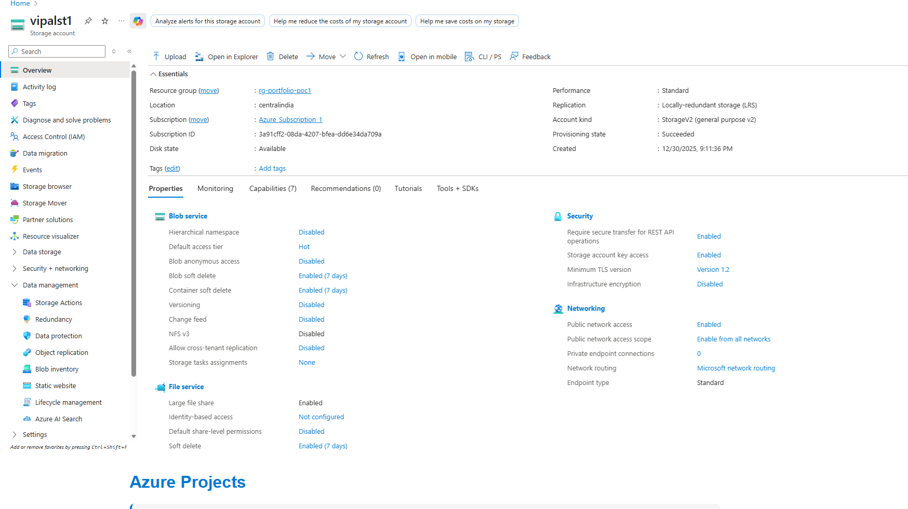
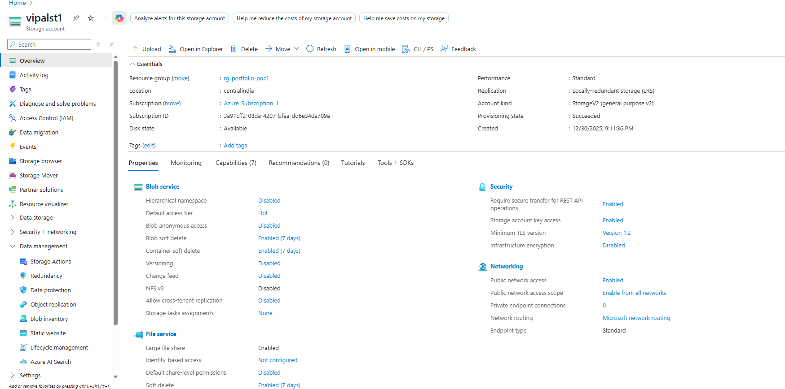
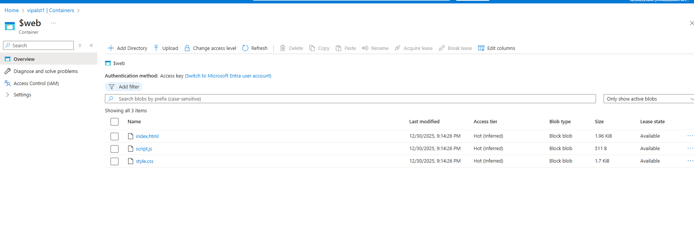

# POC 1: Static Website Hosting on Azure Storage

Personal portfolio website hosted using Azure Blob Storage's static website hosting feature.

## 🌐 Live Demo

**URL:** [https://YOUR-STORAGE-ACCOUNT.z13.web.core.windows.net/](https://vipalst1.z29.web.core.windows.net//)

## 📋 Project Overview

This project demonstrates how to host a static website on Azure using Blob Storage's built-in static website hosting capability - a cost-effective solution for hosting portfolios, documentation sites, and single-page applications.

### Features

- Responsive portfolio design
- Azure-hosted with global accessibility
- Minimal cost (under $2/month)
- Simple deployment process
- No server management required

## 🏗️ Architecture

```
User Browser
     ↓
Azure Storage Account (Static Website Enabled)
     ↓
$web Container (Public Blob Access)
     ↓
index.html + style.css + script.js
```

### Azure Resources Used

- **Resource Group:** rg-portfolio-poc1
- **Storage Account:** [your-storage-account-name](vipalst1)
- **Redundancy:** Locally-redundant storage (LRS)
- **Container:** $web (auto-created)
- **Access Level:** Public blob access

## 💰 Cost Analysis

| Component | Monthly Cost |
|-----------|--------------|
| Storage (Standard LRS) | ~$0.02 |
| Bandwidth (Light traffic) | ~$0.50-1.00 |
| **Total** | **~$1-2** |

**Annual Cost:** Less than $25/year

## 🛠️ Technologies Used

- **Frontend:** HTML5, CSS3, JavaScript (ES6)
- **Cloud Platform:** Microsoft Azure
- **Service:** Azure Blob Storage (Static Website Hosting)
- **Tools:** Azure Portal, Azure CLI (optional)

## 📚 What I Learned

### Azure Skills

1. Creating and configuring Azure Storage Accounts
2. Understanding storage account types and redundancy options
3. Enabling and configuring static website hosting
4. Working with blob storage containers
5. Managing public access levels
6. Understanding Azure pricing models (LRS vs GRS vs ZRS)
7. Cost optimization strategies for static hosting
8. Azure Portal navigation and resource management

### Technical Skills

1. Responsive web design with CSS (Beginner)
2. HTML5 semantic markup (Beginner)
3. JavaScript DOM manipulation (Beginner)
4. Git version control
5. Documentation best practices

## 🚀 Deployment Steps

### Prerequisites

- Active Azure subscription
- Basic HTML/CSS/JavaScript knowledge
- Text editor (VS Code, Notepad++, etc.)
- Web browser

### Quick Deployment

1. **Create Storage Account**: Portal → Storage accounts → Create (Standard LRS)
2. **Enable Static Website**: Settings → Static website → Enabled
3. **Upload Files**: Containers → $web → Upload your HTML/CSS/JS
4. **Access**: Use Primary endpoint URL

**Detailed steps:** See [Azure Static Website Docs](https://docs.microsoft.com/azure/storage/blobs/storage-blob-static-website)

### Live Website



### Azure Portal - Storage Account



### $web Container with Files



## 🔄 Future Enhancements

- [ ] Add Azure CDN for improved global performance
- [ ] Configure custom domain name
- [ ] Enable HTTPS with custom domain
- [ ] Implement Azure Functions for contact form backend
- [ ] Add Application Insights for visitor analytics
- [ ] Set up CI/CD pipeline with GitHub Actions
- [ ] Add automated testing
- [ ] Implement dark mode toggle

## 🧹 Cleanup Instructions

To avoid ongoing charges when done with this project:

### Via Azure Portal

1. Navigate to Resource Groups
2. Select `rg-portfolio-poc1`
3. Click "Delete resource group"
4. Type the resource group name to confirm
5. Click "Delete"

### Via Azure CLI

```bash
az group delete --name rg-portfolio-poc1 --yes --no-wait
```

## 📝 Key Takeaways

✅ **Pros:**

- Extremely cost-effective (under $2/month)
- No server management required
- Fast deployment (under 30 minutes)
- Scalable and reliable
- Perfect for static content

⚠️ **Limitations:**

- Static content only (no server-side processing)
- No built-in authentication
- Limited to HTML/CSS/JavaScript
- Requires external services for dynamic features

## 🎓 Skills Demonstrated

- Azure Portal proficiency
- Cloud resource provisioning
- Cost-conscious architecture decisions
- Static website deployment
- Documentation and communication
- Version control with Git

## 📖 Resources

- [Azure Storage Documentation](https://docs.microsoft.com/azure/storage/)
- [Static Website Hosting](https://docs.microsoft.com/azure/storage/blobs/storage-blob-static-website)
- [Azure Pricing Calculator](https://azure.microsoft.com/pricing/calculator/)

---

**Project Duration:** 2-3 hours
**Difficulty Level:** Beginner
**Date Completed:** December 2025
**Azure Services:** 2 (Storage Account, Static Website Hosting)
