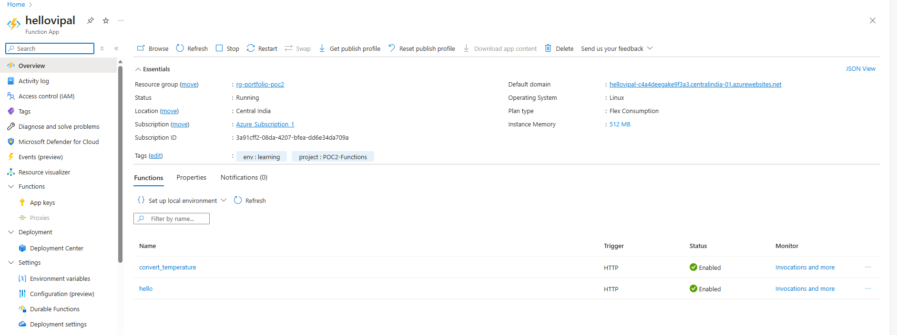
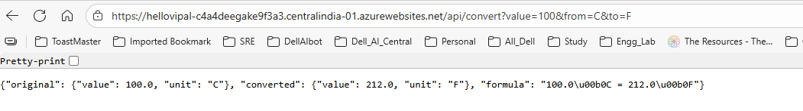

# POC 2: Serverless API with Azure Functions

Two Python serverless APIs: greeting and temperature converter.

## 🌐 Try Them Live

**Greeting:** [https://hellovipal-c4a4deegake9f3a3.centralindia-01.azurewebsites.net/api/hello?name=Azure](https://hellovipal-c4a4deegake9f3a3.centralindia-01.azurewebsites.net/api/hello?name=Azure&code=CONTACT_FOR_KEY)

**Temperature:** [https://hellovipal-c4a4deegake9f3a3.centralindia-01.azurewebsites.net/api/convert?value=100&from=C&to=F](https://hellovipal-c4a4deegake9f3a3.centralindia-01.azurewebsites.net/api/convert?value=100&from=C&to=F&code=CONTACT_FOR_KEY)

Note - Replace `CONTACT_FOR_KEY` with actual key (available on request or create issue in repo)

### 🔓 Security Note

Functions use **anonymous access** (no API keys) for easy testing and demo purposes. In production, I would implement function keys, Azure AD authentication, or API Management for proper security.

Update - I have implemented API key and it worked
 

## 🎯 What I Built

- Two HTTP-triggered functions in one Function App
- Hello API - personalized greetings with flexible input (JSON or query params)
- Temperature Converter - Celsius ↔ Fahrenheit with validation
- Serverless architecture - runs only when called, $0 cost
- Deployed on Azure Functions Flex Consumption plan

## 🏗️ Tech Stack

Python 3.11, Azure Functions (Flex Consumption), Application Insights

## 📸 Screenshots

## 💡 Key Learnings

**Azure Concepts:**

- Serverless computing - pay-per-execution, auto-scaling, no server management
- One Function App can host multiple function endpoints with different routes
- HTTP triggers for building REST APIs without managing infrastructure
- Cold start vs warm execution performance implications
- Anonymous vs authenticated authorization levels and security trade-offs
- Flex Consumption plan - modern Azure Functions hosting with improved performance

**Python Development:**

- Azure Functions SDK with decorator-based routing (@app.route)
- Handling both JSON body and URL query parameters for API flexibility
- Error handling with proper HTTP status codes (200, 400, 500)
- Type hints for better code quality
- JSON serialization and API response formatting

**Development Workflow:**

- Local development and testing with Azure Functions Core Tools
- WSL (Ubuntu) development environment setup
- VS Code Azure Functions extension for deployment
- Troubleshooting deployment issues (corrupt zip, authorization config)

## 💰 Cost

**$0/month** (Free tier: 1M requests, 400K GB-seconds)
vs Traditional VM: ~$15/month savings

## 🚀 Code

See [function-code/](./function-code/) for source code.

Local testing: `func start` then visit `http://localhost:7071/api/hello`

---

**Time:** 3 hours | **Difficulty:** Beginner | **Cost:** $0/month | **Status:** ✅ Live & Working
