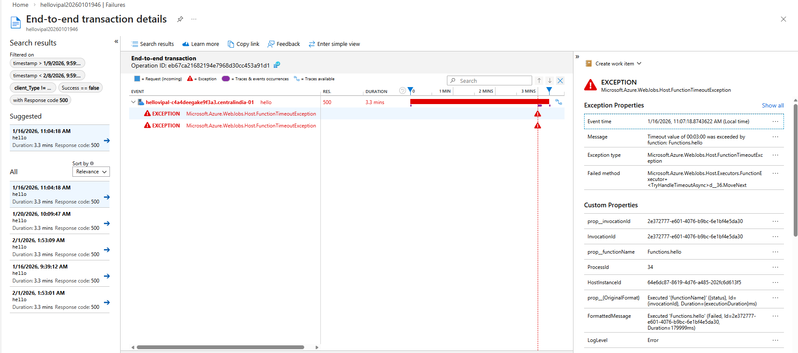
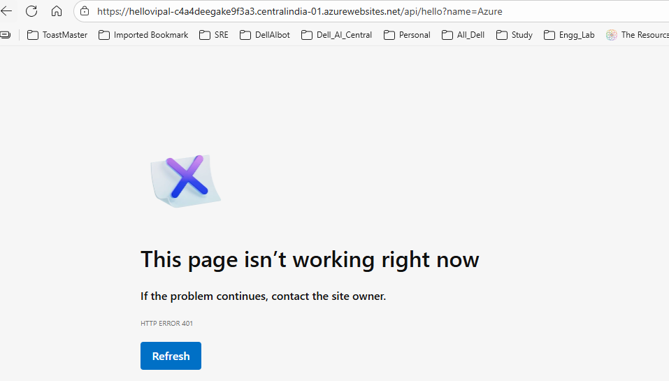
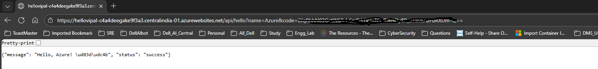

# POC 2: Lessons Learned

Collection of incidents, breaks, and learning experiences from POC 2 (Serverless API).

## Break #0: Accidental Test Code in Production

**Date:** [February 5, 2026]
**Duration:** ~24 hours
**Severity:** High (Complete service outage)
**Status:** ✅ Resolved

### What Happened

I was thinking, I deployed function, tested it with concurrent request and it is working, But what if it stop working, what are the possible reasons it could stop working,

Another question I had was, will Azure continuosly allow my function to run without any limit? I mean there has to be some kind of limit or threshold right?

I did some reading and found azure has some default timeout settings applied for each function app plan, my function app plan is "Flex Consumption", so i add sleep timer of 5 min in my function.

Redeployed the function with sleep timer for 5min and tested, Azure waited for 5 min and it initiated function cancellation, as timeout was reached with erro code 500



### Root Cause

Left time.sleep(300) in code from timeout testing session.

 I tested this, how azure respond to timeout value, but later forgot to delete it.

### Detection Process

**Initial symptoms:**
   - I was not able to reach my function URL via web browser as its HTTP function
      https://hellovipal-c4a4deegake9f3a3.centralindia-01.azurewebsites.net/api/hello?name=Azure

**Investigation steps:**
   - Checked my internet is working or not
  -  Checked if there is no firewall/NSG setting applied on function level
  -   Checked if I typed function URL correctly or not
  -   Nothig helped, so I checked App insight and found out about timeout error because of sleep function i added in the code

**Time to identify:**  1 hours

### Impact

**Technical:**
- Function timing out after 3 minutes on every request
- All API calls failing with 500 errors

**Business (if production):**
- 100% service unavailability
- Loss of user trust
- Potential revenue impact

**Actual impact (POC environment):**
- Portfolio demo broken for ~24 hours
- Learning opportunity captured ✅

### Resolution

**Fix applied:**
1. Removed `time.sleep(300)` from code
2. Removed unused `import time`
3. Redeployed function
4. Verified successful execution   (Response time - 1 sec)

**Verification:**
- ✅ Function responds successfully
- ✅ No timeout errors in Application Insights
- ✅ Response time within normal range

### Prevention Measures

**Immediate:**
- Created pre-deployment Checklists

- [ ] Remove all test code (sleep, artificial delays, debug statements)
- [ ] Remove unused imports
- [ ] Review all code changes since last deployment
- [ ] Test function locally or in dev environment
- [ ] Deploy to production
- [ ] Verify function responds successfully (smoke test)
- [ ] Check Application Insights for errors (5 min post-deployment)
- [ ] Verify response times are normal


**Long-term:**
- Consider using feature flags for testing instead of code changes
- Use separate dev/test environment for destructive tests
- Implement automated tests that would catch sleep() statements

### Key Takeaways

1. **Always revert test code immediately** - Don't assume you'll remember later
2. **Application Insights is critical for diagnostics** - Logs showed exact issue
3. **Process matters** - Checklists prevent human error
4. **Documentation turns mistakes into learning** - This incident is now a portfolio asset

### Related Incidents
- None yet (this is Break #0)

## Future Breaks

Planned break scenarios:
- Break #1: Security - Testing authentication bypass
- Break #1.5: Secrets Management
- Break #2: Resource exhaustion - Load testing concurrent requests
- Break #3: Dependency failure - Simulating external service outage

[Results will be documented here as experiments are completed]

---

## Break #1: Security Testing - Authentication Bypass

**Date:** February 14, 2026
**Duration:** ~1 hour
**Type:** Security vulnerability assessment
**Status:** ✅ Mitigated

### What We Tested

Public API with anonymous authentication - anyone with the URL could call without restrictions.

### Investigation Process

**Security assessment:**
1. Tested API accessibility from incognito browser ✅ Fully accessible
2. Checked Application Insights for client tracking:
   - Client IPs masked (0.0.0.0) - cannot block by IP
   - Geo-location data inaccurate (showed wrong city)
   - Can track sessions via `operation_Id`
3. Evaluated security control options:
   - IP blocking ❌ No real IPs available
   - Geo-blocking ❌ Location data unreliable
   - API keys ✅ Viable option
   - Rate limiting ⏳ Not tested yet

### Threat Assessment

**Identified risks:**
1. **Cost overrun** - Abuse beyond free tier (1M requests/month)
2. **Reputation damage** - DDoS could make API appear broken
3. **Unauthorized use** - API used without permission

**Decision:** Implement function-level API key authentication

### Resolution

**Changed authentication model:**
- **Before:** `auth_level=func.AuthLevel.ANONYMOUS`
- **After:** `auth_level=func.AuthLevel.FUNCTION`

**Implementation steps:**
1. Modified `function_app.py` to require function-level auth
2. Redeployed function to Azure
3. Retrieved function key from Azure Portal
4. Updated documentation with secured endpoint

**Access pattern:**
```
# Without key (blocked):
GET /api/hello?name=Test
Response: 401 Unauthorized
```

```
# With key (allowed):
GET /api/hello?name=Test&code=<function_key>
Response: 200 OK
```



### Verification

- ✅ Anonymous requests return 401 Unauthorized
- ✅ Requests with valid function key return 200 OK
- ✅ Function key managed securely in Azure Portal
- ✅ Demo still accessible (key embedded in shared URLs)

### Key Takeaways

1. **Portal vs Code configuration** - Auth level defined in code overrides portal settings
2. **Client IP limitations** - Azure Functions mask real client IPs (0.0.0.0), making IP-based blocking ineffective
3. **Geo-location unreliability** - IP geolocation databases can be inaccurate, especially for ISPs and mobile carriers
4. **Session tracking works** - Can detect abuse patterns via `operation_Id` even without real IPs
5. **Security vs accessibility trade-off** - Function keys provide security while maintaining demo accessibility (key in URL)

### Production Considerations

For production APIs, consider additional layers:
- Rate limiting per session/key
- Azure API Management for advanced throttling
- Monitoring alerts for unusual traffic patterns
- Key rotation policy
- Separate keys per consumer for tracking and revocation

### Related Incidents
- Break #0: Accidental test code in production

---

## Break #1.5: Accidentally Committing Secrets

**Date:** February 14, 2026
**Type:** Security incident (prevented)
**Status:** ✅ Caught before damage

### What Happened

Attempted to commit actual Azure Function key to public GitHub repository. GitHub Push Protection blocked the commit.

### Why This Matters

**If successful, would have resulted in:**
- Public exposure of API authentication key
- Unauthorized API usage
- Potential cost overrun
- Need for immediate key rotation

### Detection

GitHub secret scanning detected:
- "Azure Function Key" pattern in `README.md`
- "Azure Function Key" pattern in `poc2-serverless-api/README.md`
- **Blocked push automatically**

### Resolution

**Immediate action:**
1. Removed actual key from documentation
2. Used placeholder text instead
3. Added contact information for demo access

**Prevention:**
- Never commit actual secrets to version control
- Use placeholders in documentation
- For demos: Create separate "demo" keys that can be rotated
- Consider using Azure Key Vault for secret management

### Key Takeaways

1. **GitHub Push Protection works** - Saved from accidental exposure
2. **Public repos require extra care** - Assume everything is visible
3. **Demo keys vs production keys** - Separate credentials for different purposes
4. **Documentation security** - READMEs can leak secrets too, not just code

### Related Incidents
- Break #0: Test code in production
- Break #1: Authentication bypass testing

---

## Break #2: Client IP Discovery and Header Spoofing

**Date:** February 18, 2026
**Duration:** ~2 hours
**Type:** Security investigation - Network architecture and header trust
**Status:** ✅ Documented

### What We Investigated

Why does Application Insights show `client_IP: 0.0.0.0` when Azure Access Restrictions clearly see real client IPs and enforce geo-based rules?

### Background Question

**Initial observation:**
- Application Insights `requests` table: `client_IP = 0.0.0.0`
- Application Insights `requests` table: Shows correct city/country
- Access Restrictions: Can successfully block/allow by IP

**Contradiction:** How can Azure know the location without knowing the IP?

### Investigation Process

**Phase 1: Understanding the architecture**

Compared Azure Functions to POC 3 (Multi-tier network):
```
POC 3 Architecture:
Client (203.x.x.x) → Nginx → Flask API
Flask sees: Nginx's internal IP (10.0.x.x)

Azure Functions Architecture:
Client (203.x.x.x) → Azure Gateway → Function Code
Function sees: ???
```

**Key insight:** Azure Functions, like POC 3's Flask API, sits behind a reverse proxy (Azure Application Gateway).

---

**Phase 2: Finding the real client IP**

Added custom logging to function code:
```python
forwarded_ip = req.headers.get('X-Forwarded-For', 'Not found')
remote_addr = req.headers.get('REMOTE_ADDR', 'Not found')
logging.info(f'X-Forwarded-For: {forwarded_ip}')
logging.info(f'REMOTE_ADDR: {remote_addr}')
```

**Results:**
```
REMOTE_ADDR: Not found (Azure doesn't expose this)
X-Forwarded-For: 168.159.160.203:10474 ✅ Real client IP
```

**Discovery:** Real client IP IS available in the `X-Forwarded-For` header, but Application Insights doesn't log it by default in the `requests` table.

---

**Phase 3: Testing header trust (Security)**

**Question:** Can attackers spoof `X-Forwarded-For` to hide their real IP?

**Test:** Called function with fake IP header:
```bash
curl -H "X-Forwarded-For: 1.2.3.4" https://function.com/api/hello
```

**Result:**
```
X-Forwarded-For: 1.2.3.4, 168.x.x.x:2904
                 ^^^^^^^^  ^^^^^^^^^^^^^^^^^^^^
                 FAKE      REAL (added by Azure)
```

**Critical finding:** X-Forwarded-For is a comma-separated list. Client can inject fake IPs, but Azure Gateway appends the REAL IP at the end.

### Architecture Layers Explained
```
Layer 1: Client → Azure Gateway
- Azure sees REAL client IP
- Enforces Access Restrictions here
- Can block by geo/IP

Layer 2: Azure Gateway → Function Code
- Gateway strips real IP (shows 0.0.0.0 or internal IP)
- Adds X-Forwarded-For header with real IP
- Function code must read header to get real IP

Layer 3: Function Code → Application Insights
- Default telemetry logs what code sees (0.0.0.0)
- Custom logs can extract from X-Forwarded-For
```

**This explains the contradiction:**
- Access Restrictions work at Layer 1 (platform level) ✅
- Application Insights logs at Layer 3 (code level) ✅
- Both are correct for their respective layers

### Security Implications

**Vulnerable code pattern (common mistake):**
```python
# ❌ WRONG - trusts first IP (attacker controlled)
client_ip = req.headers.get('X-Forwarded-For', '').split(',')[0]
# Attacker sends: X-Forwarded-For: 1.2.3.4
# Result: Uses fake IP for rate limiting/blocking
```

**Secure code pattern:**
```python
# ✅ CORRECT - trusts rightmost IP (Azure-provided)
forwarded_for = req.headers.get('X-Forwarded-For', '')
if forwarded_for:
    # Rightmost IP is added by trusted proxy (Azure)
    client_ip = forwarded_for.split(',')[-1].strip().split(':')[0]
else:
    client_ip = '0.0.0.0'
```

**Why rightmost?** Each proxy in the chain appends the IP it sees. The rightmost IP is added by Azure Gateway (trusted), while leftmost IPs can be client-controlled (untrusted).

### Resolution

**Documented secure pattern for future implementation:**

When client IP is needed for rate limiting, logging, or security decisions:

1. **Extract from X-Forwarded-For header** (not from default telemetry)
2. **Trust rightmost IP only** (added by Azure Gateway, not client-spoofable)
3. **Handle edge cases** (missing header, port numbers, multiple proxies)


**Status:** Pattern documented, not implemented in current POC (simple hello function doesn't require IP-based logic). Available for future use cases requiring client IP (rate limiting, geo-blocking, audit logging).

**Test artifacts preserved:** Custom logging code added temporarily to verify X-Forwarded-For behavior, then removed to keep POC simple.

### Comparison: Azure Functions vs VMs

| Aspect              | VMs (POC 3)                      | Azure Functions                 |
| ---------------------| ----------------------------------| ---------------------------------|
| **IP visibility**   | Direct (VM has public IP on NIC) | Indirect (behind Azure Gateway) |
| **Access control**  | NSG attached to NIC              | Access Restrictions (app-level) |
| **Real IP in logs** | ✅ Yes (direct connection)        | ❌ No (stripped by gateway)      |
| **Getting real IP** | Available by default             | Must parse X-Forwarded-For      |
| **Spoofing risk**   | Lower (direct connection)        | Higher (must validate header)   |

### Key Takeaways

1. **Layered architecture matters** - Different layers see different things. Azure platform sees real IP, function code sees stripped IP.

2. **X-Forwarded-For is not simple** - It's a chain of IPs. Only the rightmost (added by your trusted proxy) is reliable.

3. **Default telemetry has gaps** - Application Insights logs what code sees (0.0.0.0), not what platform sees (real IP). Custom logging required.

4. **Trust model is critical** - Never trust client-provided headers blindly. Understand which headers your infrastructure adds vs which clients can spoof.

5. **POC 3 taught this concept** - Nginx reverse proxy in POC 3 had the same IP-stripping behavior. Azure Functions operates on the same principle at scale.

6. **Access Restrictions vs Logging** - Access Restrictions work at platform level (effective), but you still need custom code to LOG the IPs for audit/debugging.


### Related Incidents
- Break #0: Test code in production
- Break #1: Authentication bypass testing

---

## Future Breaks

Planned break scenarios:
- Break #3: Input validation - XSS/injection testing
- Break #4: Resource exhaustion - Load testing and scaling behavior
- Break #5: Configuration drift - Missing environment variables

[Results will be documented here as experiments are completed]
