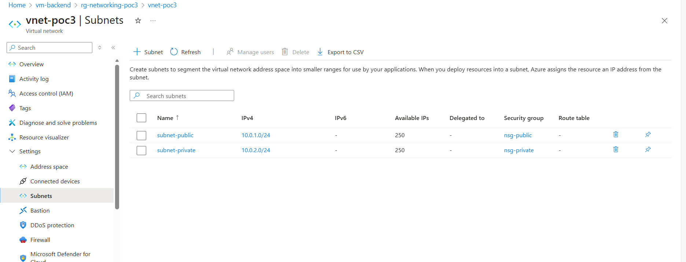
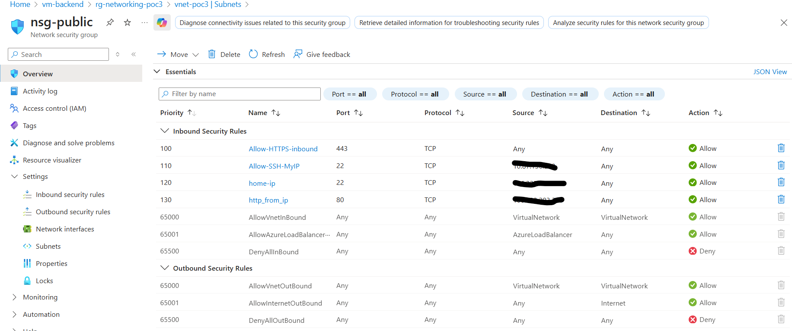
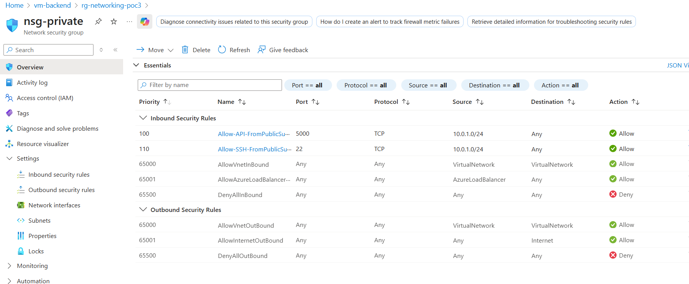
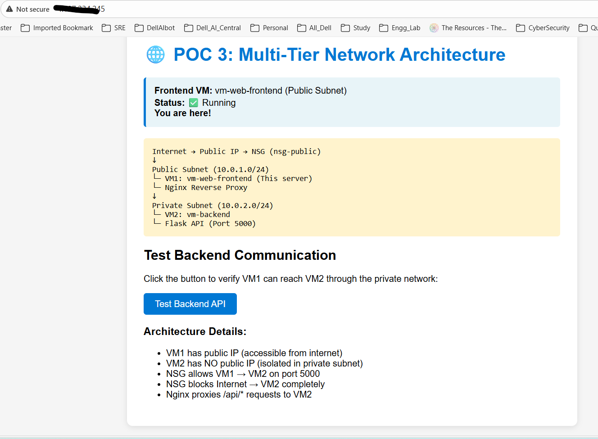
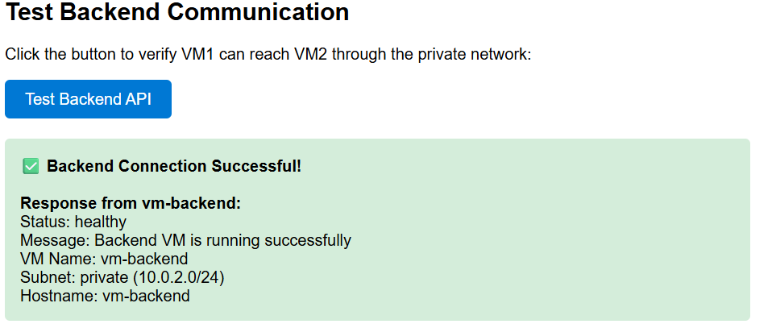

# POC 3: Multi-Tier Network Architecture with Virtual Machines

Production-like two-tier network with frontend VM (public subnet) and backend VM (private subnet), demonstrating network security, isolation, and inter-VM communication.

## 🏗️ Architecture

**Components:**

- **VNet:** 10.0.0.0/16 with public (10.0.1.0/24) and private (10.0.2.0/24) subnets
- **Frontend VM:** Ubuntu 22.04 with Nginx reverse proxy (public subnet)
- **Backend VM:** Ubuntu 22.04 with Flask API on port 5000 (private subnet, no public IP)
- **NSGs:** Custom security rules for traffic control

[Detailed architecture →](./architecture/architecture.md)

## 🎯 What I Built

**Network Infrastructure:**

- Virtual Network with CIDR planning and subnet segmentation
- Network Security Groups with least-privilege rules
- Public and private IP addressing strategy

**Compute Resources:**

- 2× Ubuntu VMs (B1s, Standard HDD for cost optimization)
- Nginx reverse proxy on frontend
- Python Flask REST API on backend

**Security Implementation:**

- SSH restricted to my IP (106.222.201.x/32)
- Backend isolated from internet (no public IP)
- Inter-VM communication on port 5000 only from frontend subnet
- Defense-in-depth with NSG on subnets and NICs

[Full configuration files →](./configuration/)

## 🏗️ Tech Stack

- **Azure:** Virtual Network, Network Security Groups, Virtual Machines (B1s)
- **OS:** Ubuntu Server 22.04 LTS
- **Web:** Nginx (reverse proxy)
- **Backend:** Python 3.10 + Flask
- **Management:** Systemd, SSH key authentication

## 📸 Screenshots

| Component           | Screenshot                                      |
| ------------------- | ----------------------------------------------- |
| Network Topology    |         |
| NSG Rules (Public)  |      |
| NSG Rules (Private) |    |
| Frontend Website    |  |
| Backend Test        |       |

## 💡 Key Learnings

**Networking:**

- CIDR notation and subnet planning (/16, /24, /32)
- Public vs private subnet design patterns
- NSG rule priority and evaluation order
- Azure's default outbound NAT behavior

**Security:**

- Defense-in-depth strategy (network + instance level)
- Principle of least privilege in NSG rules
- SSH jumpbox pattern for private VM access
- Managing dynamic home IPs with /32 restrictions

**Cost Optimization:**

- B1s sizing analysis (sufficient for POC workloads)
- Standard HDD vs SSD trade-offs
- Why Spot VMs don't support B-series
- Static vs Dynamic IP considerations

**Operational Skills:**

- Reverse proxy configuration with Nginx
- Systemd service management
- SSH agent forwarding for multi-hop access
- Network troubleshooting methodology

[Detailed testing and validation →](./testing/)

## 💰 Cost Analysis

| Resource      | Configuration          | Monthly Cost   |
| ------------- | ---------------------- | -------------- |
| VM (Frontend) | B1s, Standard HDD 30GB | ~$4            |
| VM (Backend)  | B1s, Standard HDD 30GB | ~$4            |
| Public IP     | Static, Standard SKU   | ~$3            |
| VNet + NSGs   | Standard               | $0             |
| **Total**     |                        | **~$11/month** |

**Actual POC cost:** ~$0.30 (5 hours × $0.06/hour)

**Cost decisions:**

- Standard HDD ($2/VM) vs Standard SSD ($5/VM) - 60% savings
- B1s adequate for low-traffic POC workloads
- Static IP required (Dynamic not available in Portal for Standard SKU)

## 🔐 Security Configuration

**NSG: nsg-public (Frontend)**

- Allow HTTP (80) from Internet
- Allow HTTPS (443) from Internet
- Allow SSH (22) from 106.222.201.x/32 only
- Allow outbound to 10.0.2.0/24:5000 (backend)

**NSG: nsg-private (Backend)**

- Allow API (5000) from 10.0.1.0/24 only (frontend subnet)
- Allow SSH (22) from 10.0.1.0/24 only (jumpbox pattern)
- Deny all inbound from Internet
- Allow outbound to Internet (for updates)

[Complete NSG rules documentation →](./configuration/nsg-rules.md)

## 🧪 Validation

**Verified:**

- ✅ Frontend accessible from internet via HTTP
- ✅ Backend NOT accessible from internet (no public IP)
- ✅ Frontend can communicate with backend on port 5000
- ✅ SSH to frontend works from allowed IP only
- ✅ SSH to backend only via jumpbox (frontend VM)
- ✅ Nginx reverse proxy correctly routes /api/* to backend

[Detailed test plan and results →](./testing/)

## 🚀 Deployment

**High-level process:**

1. Created VNet with public/private subnets
2. Configured NSGs with security rules
3. Deployed VMs in respective subnets
4. Configured Nginx reverse proxy on frontend
5. Deployed Flask API on backend
6. Validated connectivity and security

**Time:** 5 hours (including learning and troubleshooting)

## 📚 What's Next

**Potential improvements:**

- Add Application Gateway for SSL termination
- Implement Azure Bastion for secure management
- Add Log Analytics for monitoring
- Deploy with Infrastructure as Code (Bicep/Terraform)
- Add auto-scaling with VM Scale Sets

## 🔗 Related POCs

- [POC 1: Static Website](../poc1-static-website/) - Storage fundamentals
- [POC 2: Serverless APIs](../poc2-serverless-api/) - Serverless compute

---

**Status:** ✅ Complete | **Time:** 5 hours | **Difficulty:** Intermediate | **Cost:** $0.30
