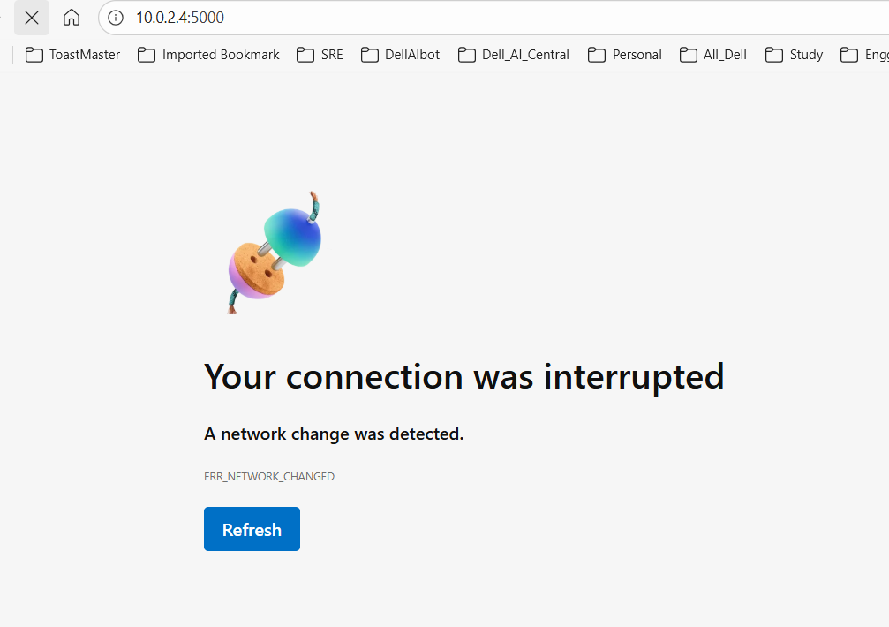
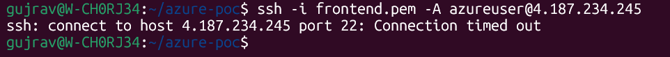
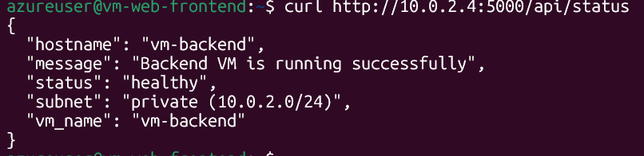
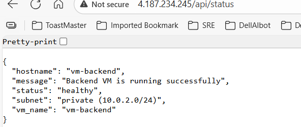
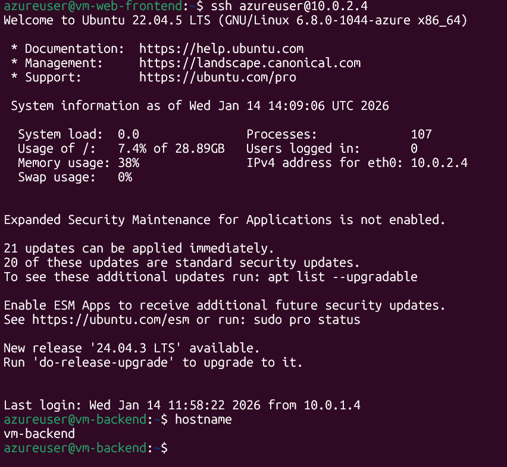
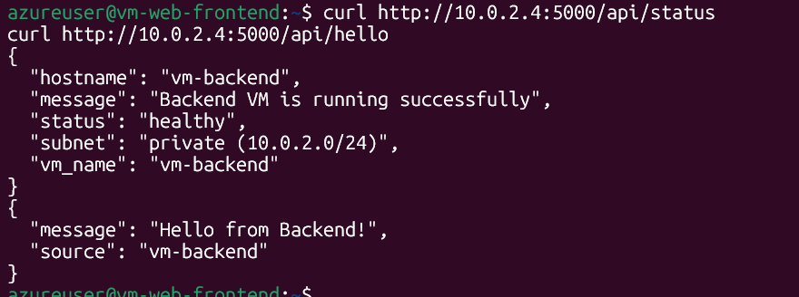

# Testing & Validation Plan

## Test Strategy

**Objective:** Verify network security, connectivity, and isolation work as designed

**Approach:** Black-box testing from multiple perspectives (internet, frontend VM, backend VM)

---

## Test Cases

### TC-001: Frontend VM Internet Accessibility

**Objective:** Verify frontend VM is reachable from internet

**Prerequisites:**

- VM1 running
- NSG allows HTTP (80)

**Steps:**

1. Open browser
2. Navigate to `http://<VM1-PUBLIC-IP>`

**Expected Result:**

- ✅ HTML page loads showing POC 3 architecture
- ❌ Connection timeout

**Actual Result:** 

**Status:** ⬜ Pass

---

### TC-002: Backend VM Internet Isolation

**Objective:** Verify backend VM is NOT accessible from internet

**Prerequisites:**

- VM2 running
- VM2 has no public IP

**Steps:**

1. Attempt to access `http://10.0.2.4:5000` from browser
2. Attempt to ping `10.0.2.4`

**Expected Result:**

- ❌ Connection timeout / unreachable
- Reason: VM2 has private IP only, no route from internet

**Actual Result:** 

**Status:** ⬜ Pass

---

### TC-003: SSH Access - Allowed IP

**Objective:** Verify SSH works from my IP only

**Prerequisites:**

- Current IP matches NSG rule (106.222.201.x)
- VM1 running

**Steps:**

```bash
ssh azureuser@<VM1-PUBLIC-IP>
```

**Expected Result:**

- ✅ SSH connection successful
- Prompt: `azureuser@vm-web-frontend:~$`

**Actual Result:** 

**Status:** ⬜ Pass

---

### TC-004: SSH Access - Blocked IP

**Objective:** Verify SSH fails from unauthorized IP

**Prerequisites:**

- Testing from IP different from NSG rule
- VM1 running

**Steps:**

1. Use VPN or mobile hotspot to get different IP
2. Attempt SSH: `ssh azureuser@<VM1-PUBLIC-IP>`

**Expected Result:**

- ❌ Connection timeout
- NSG blocks port 22 from this IP

**Actual Result:** 

**Status:** ⬜ Pass / ⬜ Fail

---

### TC-005: Frontend to Backend Communication

**Objective:** Verify VM1 can reach VM2 on port 5000

**Prerequisites:**

- Both VMs running
- Flask API running on VM2

**Steps:**

```bash
# SSH to VM1
ssh azureuser@<VM1-PUBLIC-IP>

# From VM1, curl VM2
curl http://10.0.2.4:5000/api/status
```

**Expected Result:**
```json
{
  "status": "healthy",
  "vm_name": "vm-backend",
  "subnet": "private"
}
```

**Actual Result:** 

**Status:** ⬜ Pass

---

### TC-006: Reverse Proxy Functionality

**Objective:** Verify Nginx proxies /api/* to backend

**Prerequisites:**

- Nginx configured with proxy_pass
- Flask API running

**Steps:**

```bash
curl http://<VM1-PUBLIC-IP>/api/status
```

**Expected Result:**

- ✅ JSON response from VM2
- Same response as TC-005 but accessed through public IP

**Actual Result:** 

**Status:** ⬜ Pass

---

### TC-007: Jumpbox SSH Pattern

**Objective:** Verify SSH to backend works via frontend

**Prerequisites:**

- SSH agent forwarding enabled
- Both VMs running

**Steps:**

```bash
# SSH to VM1 with agent forwarding
ssh -A azureuser@<VM1-PUBLIC-IP>

# From VM1, SSH to VM2
ssh azureuser@10.0.2.4

# Verify you're on VM2
hostname
```

**Expected Result:**

- ✅ Successfully connected to VM2
- Hostname returns: `vm-backend`

**Actual Result:** 

**Status:** ⬜ Pass

---

### TC-008: NSG Rule Priority

**Objective:** Verify NSG processes rules in priority order

**Prerequisites:**

- NSG rules configured with priorities

**Steps:**

1. Review nsg-public inbound rules
2. Verify priority order: 100 (HTTP), 110 (HTTPS), 120 (SSH)
3. Test that HTTP works (priority 100 allows)
4. Test that random port fails (default deny at 65500)

**Expected Result:**

- ✅ Rules evaluated in ascending priority order
- First match wins, processing stops

**Actual Result:** 

**Status:** ⬜ Pass

---

### TC-009: Backend API Functionality

**Objective:** Verify Flask API returns correct responses

**Prerequisites:**

- Flask running on VM2

**Steps:**

```bash
# From VM1
curl http://10.0.2.4:5000/api/status
curl http://10.0.2.4:5000/api/hello
```

**Expected Result:**

- `/api/status`: Returns health status JSON
- `/api/hello`: Returns hello message JSON

**Actual Result:** 

**Status:** ⬜ Pass

---

### TC-010: Outbound Internet from Backend

**Objective:** Verify VM2 can reach internet for updates

**Prerequisites:**

- NSG allows outbound to internet
- VM2 running

**Steps:**

```bash
# SSH to VM2 via jumpbox
ssh azureuser@<VM1-PUBLIC-IP>
ssh azureuser@10.0.2.4

# Test internet connectivity
curl -I https://www.google.com
ping -c 3 8.8.8.8
```

**Expected Result:**

- ✅ curl returns HTTP headers
- ✅ ping succeeds (if ICMP allowed)

**Actual Result:** 

**Status:** ⬜ Pass
ICMP failed because ICMP not allowed

---

## Test Environment

**Azure Region:** Central India
**VM Size:** B1s (1 vCPU, 1 GB RAM)
**OS:** Ubuntu Server 22.04 LTS
**Testing From:** Home network (106.222.201.x)
**Test Date:** [14-Jan-2026]
**Tester:** [Vipal Gujrathi]

---

## Test Results Summary

| Test ID | Test Name              | Status | Notes |
| ------- | ---------------------- | ------ | ----- |
| TC-001  | Frontend Accessibility | ⬜      |       |
| TC-002  | Backend Isolation      | ⬜      |       |
| TC-003  | SSH Allowed IP         | ⬜      |       |
| TC-004  | SSH Blocked IP         | ⬜      |       |
| TC-005  | VM-to-VM Comm          | ⬜      |       |
| TC-006  | Reverse Proxy          | ⬜      |       |
| TC-007  | Jumpbox Pattern        | ⬜      |       |
| TC-008  | NSG Priority           | ⬜      |       |
| TC-009  | API Functionality      | ⬜      |       |
| TC-010  | Outbound Internet      | ⬜      |       |
| SEC-003 | SSH Key Auth           | ⬜      |       |

**Overall Status:** ⬜ All Pass

---

## Issues Found

[Document any issues discovered during testing]

## Recommendations

[Security and Performance checks]
